# ProctorAI — AI Classroom & Exam Monitoring System

<p align="center">
  
  
  
  
  
  
</p>

<p align="center">
  <>Real-time AI-powered exam proctoring system with face detection, phone detection, behavior analysis, and a live teacher dashboard.</
</p>

---

## Table of Contents

- [Overview](#-overview)
- [System Architecture](#-system-architecture)
- [Features](#-features)
- [Project Structure](#-project-structure)
- [Screenshots](#-screenshots)
- [Technology Stack](#-technology-stack)
- [How It Works](#-how-it-works)
- [Computer Vision Modules](#-computer-vision-modules)
- [Score Calculation](#-score-calculation)
- [API Reference](#-api-reference)
- [Database Schema](#-database-schema)
- [Installation & Setup](#-installation--setup)
- [Building the EXE](#-building-the-exe)
- [Deployment](#-deployment)
- [Known Difficulties & Solutions](#-known-difficulties--solutions)
- [License](#-license)

---

## Overview

**ProctorAI** is a full-stack AI-powered proctoring system built for classroom and online exam environments. It runs as a desktop application on the student's computer during an exam, continuously analyzing behavior through the webcam using computer vision. All data is sent in real-time to a cloud backend and visualized on a web-based teacher dashboard.

The system was designed to solve a real problem: **how can a teacher monitor multiple students during a digital exam without being physically present?** ProctorAI answers this by automating behavioral monitoring through AI — detecting suspicious behaviors like phone use, looking away, talking, or multiple people in the frame — and summarizing everything with an **Attention Score** and a **Suspicious Score**.

**Live Links:**

- Dashboard: [https://ai-classroom-exam-monitoring.netlify.app](https://ai-classroom-exam-monitoring.netlify.app)
- Backend API: [https://ai-classroom-exam-monitoring.onrender.com](https://ai-classroom-exam-monitoring.onrender.com)
- Download Client: [GitHub Releases](https://github.com/Masud744/ai-classroom-exam-monitoring/releases)

---

## System Architecture

```
┌─────────────────────────────────────────────────────────────────────────┐
│                          ProctorAI System                               │
│                                                                         │
│  ┌────────────────────────┐         ┌──────────────────────────────┐   │
│  │   Student Client       │         │       Web Dashboard           │   │
│  │   (ProctorAI.exe)      │         │                              │   │
│  │                        │         │  ┌──────────┐  ┌──────────┐  │   │
│  │  ┌──────────────────┐  │  HTTPS  │  │  Teacher │  │ Student  │  │   │
│  │  │  Tkinter Login   │──┼────────►│  │Dashboard │  │Dashboard │  │   │
│  │  └────────┬─────────┘  │         │  │(Netlify) │  │(Netlify) │  │   │
│  │           │            │         │  └──────────┘  └──────────┘  │   │
│  │  ┌────────▼─────────┐  │         └──────────────────────────────┘   │
│  │  │  Camera Feed     │  │                        │                   │
│  │  │  (OpenCV)        │  │                        │ HTTPS             │
│  │  └────────┬─────────┘  │         ┌──────────────▼───────────────┐   │
│  │           │            │  HTTPS  │      FastAPI Backend          │   │
│  │  ┌────────▼─────────┐  │────────►│      (Render)                │   │
│  │  │  CV Analysis     │  │         │                              │   │
│  │  │  MediaPipe+YOLO  │  │         │  ┌────────────────────────┐  │   │
│  │  └──────────────────┘  │         │  │  Supabase              │  │   │
│  └────────────────────────┘         │  │  (PostgreSQL + Auth)   │  │   │
│                                     │  └────────────────────────┘  │   │
│                                     └──────────────────────────────┘   │
└─────────────────────────────────────────────────────────────────────────┘
```

**Data Flow:**

1. Student opens `ProctorAI.exe` → logs in via Tkinter window
2. Webcam feed analyzed frame-by-frame using MediaPipe and YOLOv8
3. Every 5 seconds, monitoring log sent to FastAPI backend via background thread
4. Backend validates and stores log in Supabase (PostgreSQL)
5. If `suspicious_score >= 50`, alert also saved to `alerts` table
6. Teacher Dashboard fetches logs every 10 seconds and displays charts and alerts

---

## Features

### Student Monitoring Client (Desktop App)

| Feature                 | Description                                                |
| ----------------------- | ---------------------------------------------------------- |
| Face Detection          | Detects whether a face is present using MediaPipe          |
| Multiple Face Detection | Flags when more than one person is visible                 |
| Eye Tracking            | Calculates Eye Aspect Ratio (EAR) to detect closed eyes    |
| Head Pose Estimation    | 3D head pose via solvePnP — detects looking away           |
| Talking Detection       | MAR variance over rolling 10-frame window                  |
| Phone Detection         | YOLOv8n model — detects mobile phones in frame             |
| Attention Score         | 0–100 score based on positive behaviors                    |
| Suspicious Score        | 0–100 score based on suspicious behaviors                  |
| Auto Logging            | Sends data every 5 seconds via background thread           |
| Login Window            | Tkinter-based login authenticating against the backend     |
| Visual Overlay          | Real-time panel showing all detection flags and score bars |
| Student Name Display    | Shows logged-in student name on monitoring panel           |

### Teacher Dashboard (Web)

| Feature            | Description                                                |
| ------------------ | ---------------------------------------------------------- |
| Total Logs         | Count of all monitoring events                             |
| Avg Attention      | Average attention score across all logs                    |
| Avg Suspicious     | Average suspicious score across all logs                   |
| High Alerts        | Count of logs with suspicious score ≥ 50                   |
| Attention Chart    | Line chart of attention scores over time                   |
| Suspicious Chart   | Line chart of suspicious scores over time                  |
| Behavior Breakdown | Doughnut chart — phone, talking, eyes closed, looking away |
| Alert List         | High suspicious events with student name and timestamp     |
| Student Dropdown   | Filter all data by individual student                      |
| Live Refresh       | Auto-refreshes every 10 seconds                            |
| Full Log Table     | Detailed table with all monitoring fields                  |

### Student Dashboard (Web)

| Feature          | Description                                     |
| ---------------- | ----------------------------------------------- |
| Personal Stats   | Own total sessions, avg scores, alerts count    |
| Score Circles    | Visual circular indicators for latest scores    |
| Status Badge     | Good Standing / Needs Attention / Under Review  |
| Improvement Tips | Auto-generated tips based on detected behaviors |
| History Charts   | Line charts of own scores over time             |
| Log History      | Table of own monitoring history                 |

### Authentication System

| Feature            | Description                                                 |
| ------------------ | ----------------------------------------------------------- |
| Student Signup     | Email + password + full name + student ID                   |
| Login              | Email/password with role-based redirect (teacher/student)   |
| Email Verification | Supabase sends confirmation email on signup via Gmail SMTP  |
| Forgot Password    | Password reset link sent via Gmail SMTP (sender: ProctorAI) |
| Role Protection    | Teachers see all students; students see only their own data |
| Teacher Account    | Created manually via Supabase dashboard (not public signup) |

---

## Project Structure

```
ai-classroom-exam-monitoring/
│
├── main.py                          # Student monitoring client (EXE entry point)
├── yolov8n.pt                       # YOLOv8 nano model weights
├── requirements.txt                 # Python dependencies (root level)
├── install.bat                      # First-time setup script for students
├── run.bat                          # Launch script for students
├── Procfile                         # Render deployment config
├── runtime.txt                      # Python version for Render
├── ProctorAI.spec                   # PyInstaller build spec
│
├── computer_vision/                 # All CV logic
│   └── behavior_analysis/
│       ├── attention_score.py       # AttentionScorer class — computes 0-100 attention
│       └── suspicious_score.py     # SuspiciousScorer class — computes 0-100 suspicion
│
├── backend/                         # FastAPI backend
│   ├── main.py                      # FastAPI app + CORS + router registration
│   ├── database.py                  # Supabase client initialization
│   ├── models.py                    # Pydantic models (MonitoringLog etc.)
│   ├── requirements.txt             # Backend-specific dependencies
│   └── routes/
│       ├── auth.py                  # /signup /login /forgot-password
│       └── logs.py                  # /log /logs /students /alerts
│
├── frontend/                        # Web dashboard (static HTML/CSS/JS)
│   ├── index.html                   # Login + Signup + Forgot Password page
│   ├── style.css                    # Login page styles
│   ├── script.js                    # Login/signup/forgot logic
│   ├── config.js                    # API base URL config
│   ├── teacher/
│   │   ├── index.html               # Teacher dashboard
│   │   ├── style.css
│   │   └── script.js               # Charts, logs, student filter logic
│   └── student/
│       ├── index.html               # Student dashboard
│       ├── style.css
│       └── script.js               # Personal scores, tips, chart logic
│
└── .github/
    └── workflows/
        └── build.yml                # GitHub Actions — auto-builds ProctorAI.exe on tag push
```

---

## Screenshots

### Desktop Client - Login Page
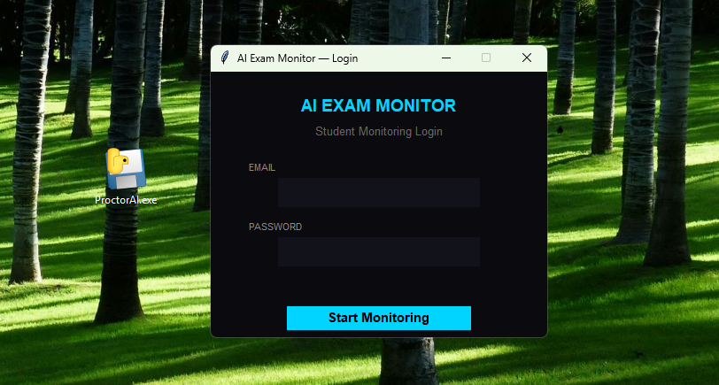
Student enters email and password to authenticate and begin monitoring session.

### Frontend - Login Page
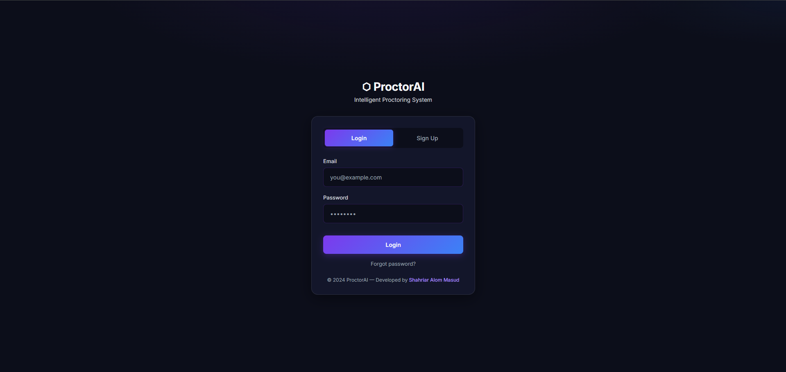
Web-based login page for accessing dashboards.

### Frontend - Signup Page
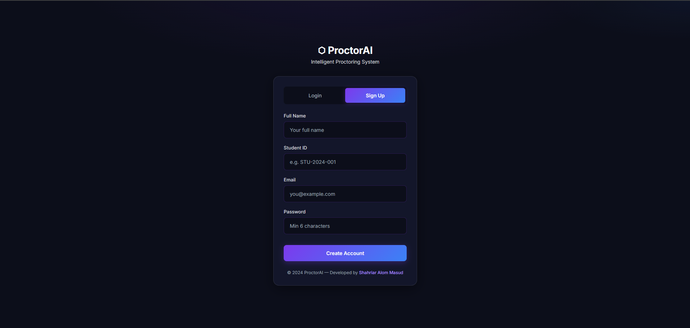
Student registration page with email, password, full name, and student ID.

### Frontend - Signup Authentication
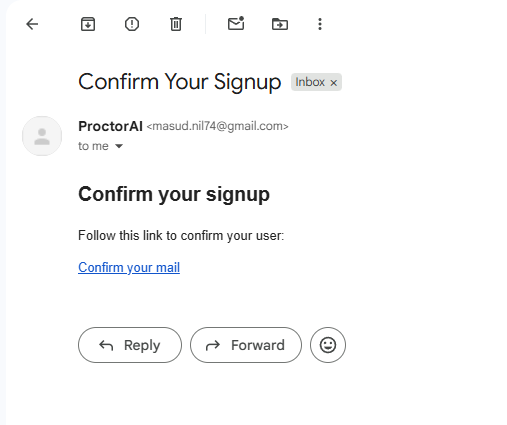
Email verification prompt for new accounts.

### Frontend - Password Reset
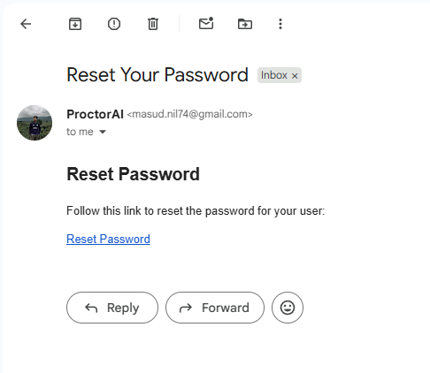
Password reset email authentication flow.

### Teacher Dashboard
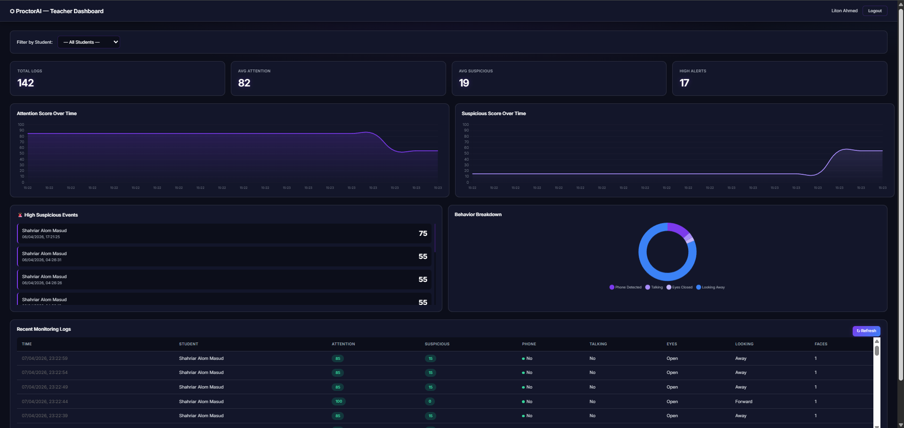
Comprehensive dashboard showing real-time monitoring data, charts, alerts, and student logs.

### Student Dashboard
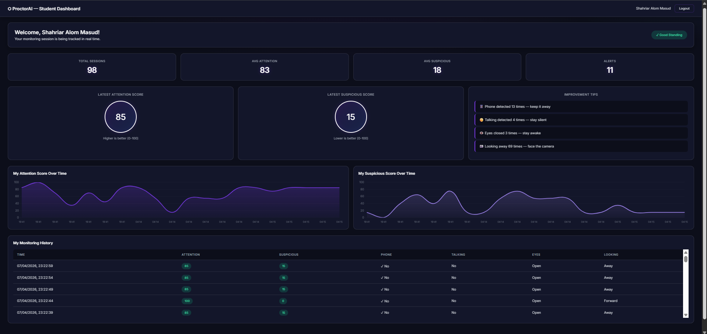
Personal dashboard showing individual scores, status, and improvement tips.

### Database Schema
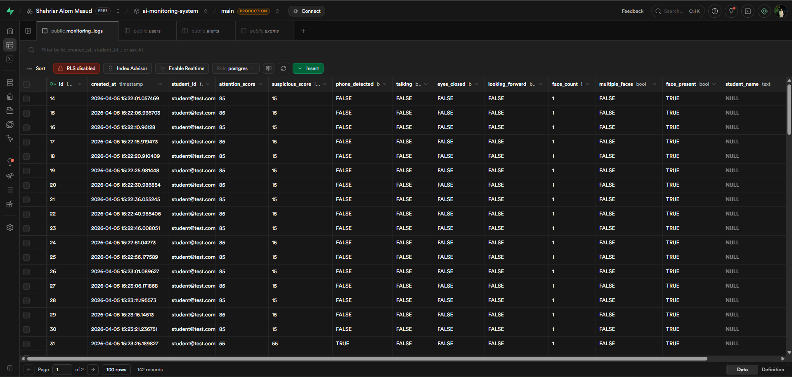
Supabase database tables structure.

### Computer Vision - Face Detection
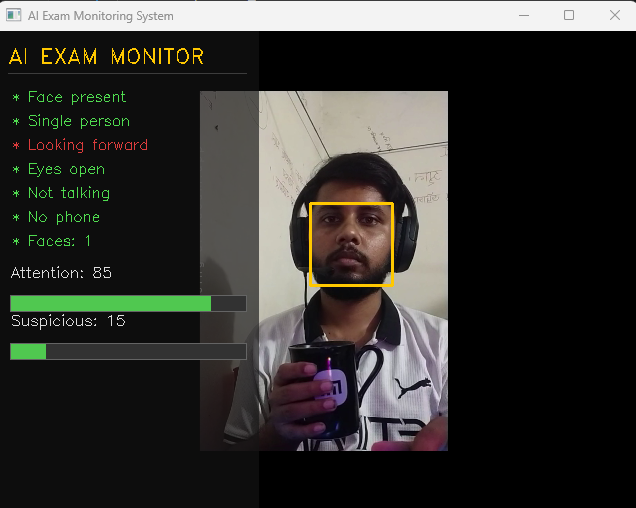
MediaPipe face mesh detection visualization.

### Computer Vision - Face Mesh
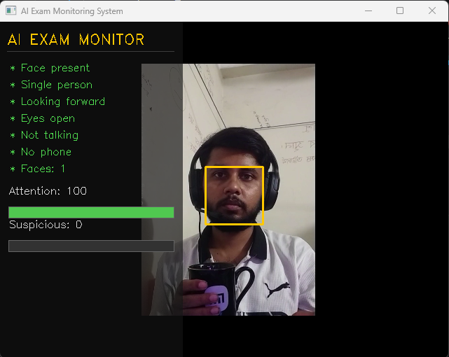
478-point facial landmark detection.

### Computer Vision - Eye Tracking
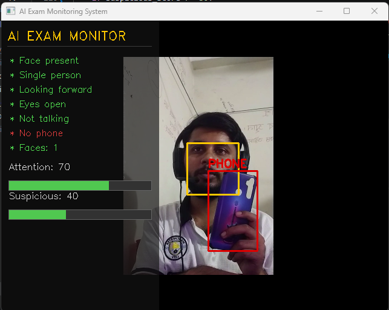
Eye aspect ratio calculation for blink detection.

### Computer Vision - Mouth Tracking
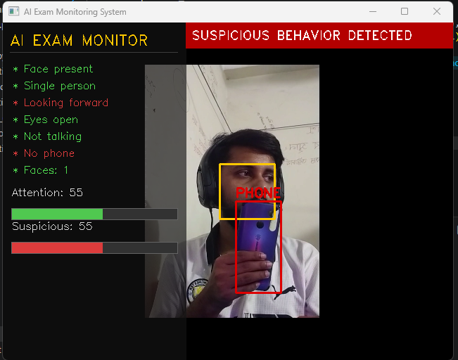
Mouth aspect ratio for talking detection.

### Computer Vision - Head Pose
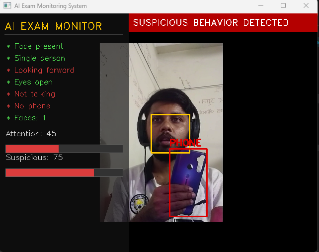
3D head pose estimation with solvePnP.

---

## Technology Stack

### Desktop Client

| Tool               | Purpose                                   |
| ------------------ | ----------------------------------------- |
| Python 3.10        | Core language                             |
| OpenCV             | Camera capture and frame processing       |
| MediaPipe 0.10.9   | Face mesh, 478-point landmark detection   |
| Ultralytics YOLOv8 | Real-time phone object detection          |
| NumPy              | Matrix math for EAR, MAR, head pose       |
| Tkinter            | Login window GUI                          |
| Requests           | HTTP calls to backend API                 |
| Threading          | Parallel YOLO inference and log uploading |
| PyInstaller        | Packaging into single `.exe`              |

### Backend

| Tool                | Purpose                          |
| ------------------- | -------------------------------- |
| FastAPI             | REST API framework               |
| Supabase Python SDK | Database and Auth client         |
| Pydantic            | Request/response data validation |
| Uvicorn             | ASGI server                      |
| Render              | Cloud deployment (free tier)     |

### Database & Auth

| Tool          | Purpose                                                  |
| ------------- | -------------------------------------------------------- |
| Supabase      | PostgreSQL database + built-in Auth system               |
| Supabase Auth | Email/password login, email verification, password reset |
| Gmail SMTP    | Custom email sender for branded ProctorAI emails         |

### Frontend

| Tool               | Purpose                                       |
| ------------------ | --------------------------------------------- |
| HTML5 / CSS3       | Structure and styling                         |
| Vanilla JavaScript | API calls and all interactivity               |
| Chart.js 4.4.1     | Line charts and doughnut charts               |
| Netlify            | Static site hosting, auto-deploys from GitHub |

### CI/CD

| Tool                        | Purpose                                         |
| --------------------------- | ----------------------------------------------- |
| GitHub Actions              | Auto-builds `.exe` on `git tag` push            |
| windows-latest runner       | Builds Windows executable in the cloud          |
| softprops/action-gh-release | Uploads `.exe` to GitHub Releases automatically |

---

## How It Works

### Step 1 — Student Login

Student opens `ProctorAI.exe`. A Tkinter window asks for email and password. Credentials are sent via HTTPS POST to `/api/auth/login`. Backend calls Supabase Auth. If login succeeds and the user role is `student`, the monitoring session begins. Teacher accounts cannot use the desktop client.

### Step 2 — Camera Monitoring Loop

OpenCV opens the webcam (`cv2.VideoCapture(0)`) and begins a continuous frame loop. Every frame goes through:

1. **MediaPipe Face Detection** → face count, presence, multiple faces flag
2. **MediaPipe Face Mesh** → 478 3D landmarks per face
3. **EAR Calculation** → Eye Aspect Ratio from 6 landmarks per eye to detect closed eyes
4. **MAR Calculation** → Mouth Aspect Ratio variance over rolling 10 frames to detect talking
5. **Head Pose (solvePnP)** → rotation vector → matrix → Euler angles → ±15° forward check
6. **YOLO Phone Detection** → separate daemon thread; flags phones ≥ 2% of frame area to reduce false positives

### Step 3 — Score Calculation

Every frame, both Attention and Suspicious scores are recalculated from the current detection flags and displayed on the real-time overlay panel.

### Step 4 — Auto Logging

Every 5 seconds, a background `threading.Thread` POSTs current scores and all flags to `/api/log`. Non-blocking so the camera loop never pauses.

### Step 5 — Backend Storage

FastAPI validates the request with Pydantic and inserts into `monitoring_logs` in Supabase. If `suspicious_score >= 50`, also inserts into `alerts` with a human-readable description of the reasons.

### Step 6 — Teacher Dashboard

JavaScript fetches `/api/logs` every 10 seconds. Renders Chart.js graphs, alert cards, behavior breakdown doughnut chart, and a full detailed log table. Teacher can filter by student from a dropdown.

---

## Computer Vision Modules

### Eye Tracking — EAR (Eye Aspect Ratio)

```
        |p2 - p6| + |p3 - p5|
EAR =  ──────────────────────
              2 * |p1 - p4|

LEFT_EYE  = [33, 160, 158, 133, 153, 144]
RIGHT_EYE = [362, 385, 387, 263, 373, 380]
Threshold: EAR < 0.20 → eyes_closed = True
```

### Head Pose Estimation — solvePnP

```
Landmarks used: [33, 263, 1, 61, 291, 199]

cv2.solvePnP()     → rotation vector
cv2.Rodrigues()    → rotation matrix
cv2.RQDecomp3x3()  → Euler angles (x, y, z)

Forward condition:
  -15° ≤ y_angle * 360 ≤ 15°  AND  -15° ≤ x_angle * 360 ≤ 15°
```

### Talking Detection — MAR Variance

```
        |p2-p8| + |p3-p7| + |p4-p6|
MAR =  ─────────────────────────────
                2 * |p1-p5|

MOUTH = [61, 81, 13, 311, 308, 402, 14, 178]
Rolling window: deque(maxlen=10)
np.var(mar_history) > 0.002 → talking = True
```

### Phone Detection — YOLOv8n

```
Model: yolov8n.pt (nano — optimized for speed)
Confidence threshold: 0.4
Class filter: "cell phone" only
Size filter: bounding_box_area >= frame_area * 0.02
Threading: separate daemon thread sharing frame via threading.Lock()
```

---

## Score Calculation

### Attention Score (0–100)

Starts at 100, deducts for each negative behavior:

| Condition           | Deduction |
| ------------------- | --------- |
| No face present     | −40       |
| Phone detected      | −30       |
| Multiple faces      | −30       |
| Eyes closed         | −20       |
| Not looking forward | −15       |
| Talking             | −10       |

Clamped to minimum 0.

### Suspicious Score (0–100)

Starts at 0, adds for each suspicious behavior:

| Condition           | Addition |
| ------------------- | -------- |
| Phone detected      | +40      |
| Multiple faces      | +30      |
| Talking             | +20      |
| No face present     | +20      |
| Not looking forward | +15      |
| Eyes closed         | +10      |

Clamped to maximum 100. Score ≥ 50 → red alert banner on screen + saved to `alerts` table.

---

## API Reference

**Base URL:** `https://ai-classroom-exam-monitoring.onrender.com/api`

| Method | Endpoint                | Description                            |
| ------ | ----------------------- | -------------------------------------- |
| POST   | `/auth/signup`          | Register a new student                 |
| POST   | `/auth/login`           | Login, returns JWT access token        |
| POST   | `/auth/forgot-password` | Send password reset email              |
| POST   | `/log`                  | Submit a monitoring log entry          |
| GET    | `/logs`                 | Get all logs (no limit — teacher view) |
| GET    | `/logs/{student_id}`    | Get logs for a specific student        |
| GET    | `/students`             | Get list of unique students from logs  |
| GET    | `/alerts`               | Get high suspicious alert events       |

### POST /log — Request Body Example

```json
{
  "student_id": "student@email.com",
  "student_name": "Shahriar Alom Masud",
  "attention_score": 85,
  "suspicious_score": 15,
  "phone_detected": false,
  "talking": false,
  "eyes_closed": false,
  "looking_forward": true,
  "face_count": 1,
  "multiple_faces": false,
  "face_present": true
}
```

---

## Database Schema

```sql
create table monitoring_logs (
  id               int8 primary key generated always as identity,
  created_at       timestamptz default now(),
  student_id       text,
  student_name     text,
  attention_score  int,
  suspicious_score int,
  phone_detected   bool,
  talking          bool,
  eyes_closed      bool,
  looking_forward  bool,
  face_count       int,
  multiple_faces   bool,
  face_present     bool
);

create table alerts (
  id               uuid primary key default gen_random_uuid(),
  created_at       timestamptz default now(),
  alert_type       text,
  suspicious_score int,
  description      text,
  is_reviewed      bool default false
);

create table users (
  id         uuid primary key default gen_random_uuid(),
  created_at timestamptz default now(),
  email      text unique not null,
  full_name  text,
  role       text check (role in ('student', 'teacher')) default 'student',
  student_id text unique
);
```

---

## Installation & Setup

### Option A — Download Release (For Students)

1. Go to [GitHub Releases](https://github.com/Masud744/ai-classroom-exam-monitoring/releases)
2. Download `ProctorAI.exe` from the latest release
3. Run the `.exe` directly — no installation needed
4. Login with your student credentials

**Requirements:** Windows 10/11, Webcam, Internet connection

### Option B — Run from Source (For Developers)

```bash
git clone https://github.com/Masud744/ai-classroom-exam-monitoring.git
cd ai-classroom-exam-monitoring

python -m venv venv
venv\Scripts\activate

pip install opencv-python mediapipe==0.10.9 ultralytics requests numpy
```

Create `backend/.env`:

```
SUPABASE_URL=your_supabase_project_url
SUPABASE_KEY=your_supabase_anon_key
```

Run backend:

```bash
uvicorn backend.main:app --reload --port 8000
```

Run monitoring client:

```bash
python main.py
```

Open frontend locally:

```bash
cd frontend
python -m http.server 8080
# Visit http://localhost:8080
```

---

## Building the EXE

The project supports two ways to build the Windows executable.

### Method 1 — GitHub Actions (Automated, Recommended)

This is the primary release method. Push a version tag and GitHub Actions automatically builds and publishes the `.exe` to GitHub Releases — no local build environment needed.

```bash
git tag v2.0.0
git push origin v2.0.0
```

The workflow (`.github/workflows/build.yml`) runs on `windows-latest` in the cloud:

1. Checks out the repository code
2. Sets up Python 3.10
3. Installs all dependencies including PyInstaller
4. Downloads `yolov8n.pt` automatically using Ultralytics
5. Runs PyInstaller with all required flags (`--collect-data mediapipe`, `--hidden-import`, etc.)
6. Uploads `ProctorAI.exe` as both a build artifact and to GitHub Releases

This method ensures a clean, reproducible build every time without needing a local Windows machine or worrying about dependency conflicts.

### Method 2 — Manual PyInstaller (Local Build)

If you want to build locally on a Windows machine:

```bash
pip install pyinstaller
pyinstaller --onefile --windowed --name "ProctorAI" \
  --add-data "yolov8n.pt;." \
  --add-data "computer_vision;computer_vision" \
  --collect-data mediapipe \
  --hidden-import "computer_vision.behavior_analysis.attention_score" \
  --hidden-import "computer_vision.behavior_analysis.suspicious_score" \
  main.py
```

Output will be in `dist/ProctorAI.exe`.

> **Note:** Local builds may vary depending on your installed packages and Python version. The GitHub Actions build is always preferred for releases as it uses a clean, consistent environment.

---

## Deployment

### Backend — Render

- Platform: [render.com](https://render.com) (free tier)
- Start command: `uvicorn backend.main:app --host 0.0.0.0 --port $PORT`
- Build command: `pip install -r backend/requirements.txt`
- Live URL: `https://ai-classroom-exam-monitoring.onrender.com`
- **Note:** Free tier sleeps after inactivity — first request may take ~50 seconds. A keep-alive ping runs every 30 seconds from dashboard JS to minimize this.

### Frontend — Netlify

- Platform: [netlify.com](https://netlify.com)
- Auto-deploys from GitHub `main` branch on every push
- Publish directory: `frontend/`
- Live URL: `https://ai-classroom-exam-monitoring.netlify.app`

### Database & Auth — Supabase

- PostgreSQL database with tables: `monitoring_logs`, `alerts`, `users`, `sessions`, `exams`
- Supabase Auth handles signup, login, email verification, and password reset
- **Custom Gmail SMTP** configured so all emails come from `ProctorAI <masud.nil74@gmail.com>`
- Supabase URL Configuration set to Netlify URL so email links redirect correctly

---

## Known Difficulties & Solutions

### 1. MediaPipe Files Not Found After Building EXE

**Problem:** After building with PyInstaller, running the `.exe` showed `FileNotFoundError` deep inside `mediapipe/python/solutions/face_detection.py`. MediaPipe uses internal `.tflite` model files that PyInstaller doesn't bundle automatically.

**Root Cause:** PyInstaller only bundles Python files by default. MediaPipe's binary model data files are not Python files and are skipped.

**Solution:** Added `--collect-data mediapipe` to the PyInstaller command. This tells PyInstaller to recursively include all data files from the MediaPipe package directory, including all `.tflite` model files.

---

### 2. yolov8n.pt Not Found at Runtime in EXE

**Problem:** The `.exe` crashed when trying to load the YOLO model. PyInstaller extracts bundled files into a temporary directory (`sys._MEIPASS`) at runtime, not the original working directory.

**Solution:** Added runtime path detection at the top of `main.py`:

```python
if getattr(sys, 'frozen', False):
    BASE_PATH = sys._MEIPASS
else:
    BASE_PATH = os.path.dirname(os.path.abspath(__file__))

yolo_model = YOLO(os.path.join(BASE_PATH, "yolov8n.pt"))
```

Also added `--add-data "yolov8n.pt;."` to include the file in the bundle.

---

### 3. GitHub Actions — Deprecated Action Versions

**Problem:** The first CI build failed immediately with: `This request has been automatically failed because it uses a deprecated version of actions/upload-artifact: v3`.

**Solution:** Updated all action versions in `build.yml`:

- `actions/checkout@v3` → `@v4`
- `actions/setup-python@v4` → `@v5`
- `actions/upload-artifact@v3` → `@v4`
- `softprops/action-gh-release@v1` → `@v2`

---

### 4. yolov8n.pt Missing in GitHub Actions CI

**Problem:** Build failed with `ERROR: Unable to find yolov8n.pt`. The model file was not committed to the repository (gitignored due to file size).

**Solution:** Added an automatic download step in the workflow before the build:

```yaml
- name: Download YOLOv8 model
  run: |
    python -c "from ultralytics import YOLO; YOLO('yolov8n.pt')"
```

Ultralytics downloads `yolov8n.pt` to the current directory on first use.

---

### 5. GitHub Actions — Release Upload 403 Forbidden

**Problem:** The `Upload to Release` step failed with `403: Resource not accessible by integration`. GitHub Actions' default token didn't have permission to create releases.

**Solution:** Repository → Settings → Actions → General → Workflow permissions → changed to **"Read and write permissions"**. This allows `GITHUB_TOKEN` to create and upload to GitHub Releases.

---

### 6. GitHub Workflow File Not Triggering

**Problem:** After the first push, the workflow never appeared in the Actions tab.

**Root Cause:** The `build.yml` file was accidentally placed in `.github/` instead of `.github/workflows/`. GitHub only recognizes workflow files inside the `workflows/` subdirectory.

**Solution:**

```bash
mkdir .github\workflows
move .github\build.yml .github\workflows\build.yml
git add -f .github/
git commit -m "Fix workflow file location"
git push origin main
```

The `-f` flag was needed because `.github/` is treated as a hidden folder by Git on Windows.

---

### 7. YOLO Inference Blocking the Camera Loop

**Problem:** Running YOLO inference synchronously dropped the frame rate from ~30fps to ~3fps. YOLO takes 200–400ms per frame, making the monitoring UI very laggy.

**Solution:** Moved YOLO inference into a separate daemon thread. The main loop shares the latest frame via `threading.Lock()` and reads `phone_detected_global` without waiting:

```python
yolo_lock = threading.Lock()

def yolo_worker():
    global phone_detected_global, phone_boxes_global, yolo_frame
    while True:
        with yolo_lock:
            frame = yolo_frame.copy() if yolo_frame is not None else None
        if frame is None:
            continue
        # run inference ...

yolo_thread = threading.Thread(target=yolo_worker, daemon=True)
yolo_thread.start()
```

---

### 8. Password Reset Email Redirecting to localhost

**Problem:** Clicking the password reset link in the email redirected to `localhost:3000` — Supabase's default. Only worked on the developer's machine.

**Solution (two parts):**

Supabase Dashboard → Authentication → URL Configuration:

- **Site URL:** `https://ai-classroom-exam-monitoring.netlify.app`
- **Redirect URLs:** added base URL and `https://ai-classroom-exam-monitoring.netlify.app/**`

Updated `auth.py` to pass the redirect URL explicitly:

```python
supabase.auth.reset_password_for_email(
    data.email,
    {"redirect_to": "https://ai-classroom-exam-monitoring.netlify.app"}
)
```

---

### 9. computer_vision Module Not Found in EXE

**Problem:** `.exe` crashed with `ModuleNotFoundError: No module named 'computer_vision'`. PyInstaller didn't know about the local package.

**Solution (three parts):**

1. Added `--add-data "computer_vision;computer_vision"` to bundle the directory
2. Added `--hidden-import` flags for specific submodules
3. Inserted `BASE_PATH` into `sys.path` at runtime:

```python
sys.path.insert(0, os.path.join(BASE_PATH, 'computer_vision'))
```

---

### 10. MediaPipe Version Compatibility

**Problem:** Newer versions of MediaPipe (0.10.10+) removed the `mp.solutions` API that the project relies on.

**Solution:** Pinned MediaPipe to a specific compatible version everywhere — in `requirements.txt` and in the GitHub Actions workflow: `mediapipe==0.10.9`.

---

### 11. Render Free Tier Cold Start Delay

**Problem:** After a period of inactivity, Render's free tier spins down the backend. The first request takes 50+ seconds, making the dashboard appear broken.

**Solution:** Added a keep-alive ping in the teacher dashboard JavaScript that calls the backend root endpoint every 30 seconds during active dashboard sessions:

```javascript
setInterval(() => {
  fetch(`${API.replace("/api", "")}/`).catch(() => {});
}, 30000);
```

---

## Author

Shahriar Alom Masud  
B.Sc. Engg. in IoT & Robotics Engineering  
University of Frontier Technology, Bangladesh  
Email: shahriar0002@std.uftb.ac.bd  
LinkedIn: https://www.linkedin.com/in/shahriar-alom-masud

---

## License

MIT License — Copyright © 2026 ProctorAI

Permission is hereby granted, free of charge, to any person obtaining a copy of this software to deal in the Software without restriction, including without limitation the rights to use, copy, modify, merge, publish, distribute, sublicense, and/or sell copies of the Software.

---

## Acknowledgments

- [MediaPipe](https://mediapipe.dev/) — Face mesh and landmark detection
- [Ultralytics YOLOv8](https://ultralytics.com/) — Real-time phone object detection
- [FastAPI](https://fastapi.tiangolo.com/) — Backend API framework
- [Supabase](https://supabase.com/) — Database and authentication
- [Chart.js](https://www.chartjs.org/) — Dashboard data visualization
- [Netlify](https://netlify.com/) — Frontend hosting
- [Render](https://render.com/) — Backend hosting
- [GitHub Actions](https://github.com/features/actions) — Automated EXE builds

---

If you like this project, give it a star on GitHub!
